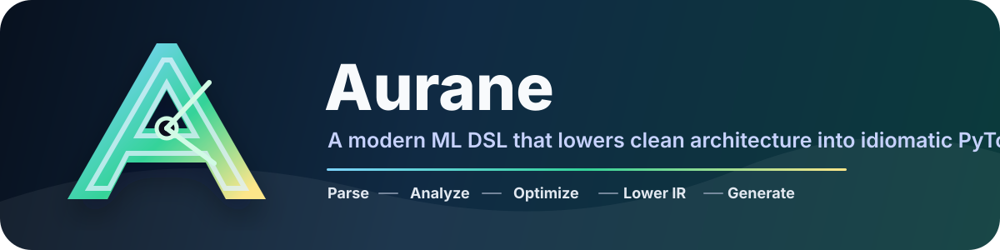
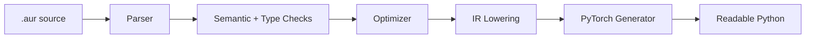

<p align="center">
  
</p>

<p align="center">
  <a href="https://www.python.org/downloads/"></a>
  <a href="https://pytorch.org/"></a>
  <a href="https://github.com/desenyon/aurane"></a>
  <a href="https://github.com/psf/black"></a>
  <a href="https://opensource.org/licenses/MIT"></a>
</p>

<p align="center">
  <strong>Write focused model architecture in <code>.aur</code>. Ship readable PyTorch.</strong><br>
  Aurane is a compiler-oriented machine learning DSL with parsing, semantic checks, type/shape inference, IR lowering, optimization, profiling, visualization, and a polished CLI workflow.
</p>

---

## Why Aurane

Aurane keeps model authoring compact without hiding the generated code. It is designed for developers who want high-signal model definitions, fast feedback from analysis tools, and clean Python output that still feels familiar to PyTorch users.



## Quick Look

```aur
use torch

experiment SimpleExample:
    seed = 42
    device = "cpu"

model TinyNet:
    input_shape = (3, 32, 32)
    def forward(x):
        x -> conv2d(16, kernel=3).relu
          -> maxpool(2)
          -> flatten()
          -> dense(64).relu
          -> dense(10)
```

Compile it:

```bash
aurane compile examples/simple.aur tiny_net.py --validate --format
```

Generated shape:

```python
class TinyNet(nn.Module):
    def __init__(self):
        super().__init__()
        self.conv2d1 = nn.Conv2d(3, 16, 3, stride=1, padding=0)
        self.dense1 = nn.Linear(3600, 64)
        self.dense2 = nn.Linear(64, 10)

    def forward(self, x):
        x = F.relu(self.conv2d1(x))
        x = F.max_pool2d(x, 2)
        x = torch.flatten(x, 1)
        x = F.relu(self.dense1(x))
        x = self.dense2(x)
        return x
```

## Install

```bash
git clone https://github.com/desenyon/aurane.git
cd aurane

# Compiler and CLI
pip install -e .

# Full ML extras
pip install -e ".[all]"

# Developer tools
pip install -e ".[dev]"
```

Requirements:

- Python 3.10+
- Rich for the CLI experience
- PyTorch 2.0+ for running generated ML programs

## CLI Surface

| Command | Purpose | Example |
| --- | --- | --- |
| `compile` | Generate Python from `.aur` | `aurane compile model.aur model.py --validate --format` |
| `check` | Run semantic and type/shape checks | `aurane check model.aur --semantic --types --json` |
| `inspect` | Browse AST and model stats | `aurane inspect model.aur --verbose --stats --export ast.json` |
| `visualize` | Render architecture graphs | `aurane visualize model.aur --format mermaid` |
| `profile` | Estimate params, FLOPs, memory | `aurane profile model.aur --detailed` |
| `ir` | Dump lowered intermediate representation | `aurane ir model.aur --format json` |
| `watch` | Recompile on change | `aurane watch model.aur model.py --analyze` |
| `lint` | Find and fix simple source issues | `aurane lint model.aur --auto-fix` |
| `format` | Normalize Aurane source style | `aurane format examples/ --check` |

## Release 2.0 Highlights

- **Graph-aware parser**: supports sequential chains and explicit graph-style forward definitions without confusing kwargs for assignments.
- **Backend registry**: code generation now routes through a backend layer instead of hard-coding one path.
- **IR tooling**: lower models into a structured intermediate representation with `aurane ir`.
- **First-class checks**: semantic analysis and type/shape validation are exposed through `aurane check`.
- **Safer CLI exits**: `python -m aurane.cli` now preserves command return codes.
- **Stable cache keys**: cached compilation output includes backend/options/schema information to avoid stale generated code.
- **Better visualization**: Mermaid and DOT output preserve labels, shapes, and parameter counts.
- **Release-grade examples**: the bundled CNN, ResNet, Transformer, GAN, and simple examples compile, check, and syntax-validate.

## Language Features

| Area | Supported |
| --- | --- |
| Models | `model`, `input_shape`, sequential forward chains, graph forward blocks |
| Layers | `conv2d`, `dense`, `linear`, `flatten`, `maxpool`, `avgpool`, `dropout`, `batch_norm`, `batchnorm`, `reshape`, `embedding`, `multihead_attention`, `layer_norm`, `positional_encoding` |
| Activations | `relu`, `gelu`, `sigmoid`, `tanh`, `softmax`, `leaky_relu`, `residual` |
| Analysis | semantic issues, type/shape inference, parameter counts, FLOPs estimates |
| Output | idiomatic PyTorch modules and training scaffolds |

## Examples

The `examples/` directory includes:

- `simple.aur` - compact CNN starter
- `mnist.aur` - MNIST training pipeline
- `resnet.aur` - deeper convolutional classifier
- `transformer.aur` - language-model style architecture
- `gan.aur` - generator/discriminator pair

Run the full example smoke path:

```bash
for file in examples/*.aur; do
  aurane check "$file" --semantic --types
  aurane compile "$file" "/tmp/$(basename "$file" .aur).py" --quiet
done
```

## Project Map

```text
aurane/
  parser.py              # .aur source to AST
  semantic_analyzer.py   # DSL-level diagnostics
  type_checker.py        # tensor shape/type checks
  optimizer.py           # AST optimization passes
  ir.py                  # intermediate representation
  backends/              # backend registry and torch backend
  codegen_torch.py       # PyTorch source generation
  profiler.py            # params/FLOPs/memory estimates
  visualizer.py          # rich, Mermaid, and DOT architecture output
  cli/                   # command-line interface
```

## Development

```bash
uv run --extra dev black --check aurane tests
uv run --extra dev mypy aurane
uv run --extra dev pytest -q
uv build
```

Release smoke:

```bash
for file in examples/*.aur; do
  out="/tmp/aurane-$(basename "$file" .aur).py"
  uv run aurane compile "$file" "$out" --quiet
  uv run aurane check "$file" --semantic --types --json >/tmp/aurane-check.json
done
```

## Documentation

- [Getting Started](docs/getting-started.md)
- [CLI Reference](docs/cli-commands.md)
- [Language Reference](docs/language-reference.md)
- [Examples Guide](docs/examples.md)

## License

Aurane is released under the MIT License.
