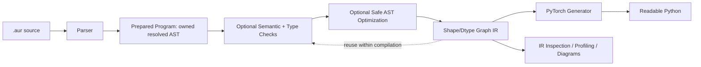

<p align="center">
  
</p>

<p align="center">
  <a href="https://www.python.org/downloads/"></a>
  <a href="https://pytorch.org/"></a>
  <a href="https://github.com/desenyon/aurane"></a>
  <a href="https://github.com/psf/black"></a>
  <a href="https://opensource.org/licenses/MIT"></a>
</p>

<p align="center">
  <strong>Write focused model architecture in <code>.aur</code>. Ship readable PyTorch.</strong><br>
  Aurane provides model compilation, graph checks, training code, profiling, visualization, and command-line tools.
</p>

---

## Why Aurane

Aurane keeps model authoring compact without hiding the generated code. It is designed for developers who want high-signal model definitions, fast feedback from analysis tools, and clean Python output that still feels familiar to PyTorch users.


```mermaid
flowchart LR
    A[".aur source"] --> B["Parser"]
    B --> S["Prepared Program: owned resolved AST"]
    S --> C["Optional Semantic + Type Checks"]
    C --> D["Optional Safe AST Optimization"]
    D --> E["Shape/Dtype Graph IR"]
    E --> F["PyTorch Generator"]
    F --> G["Readable Python"]
    E --> H["IR Inspection / Profiling / Diagrams"]
    E -. "reuse within compilation" .-> C
```

The current source includes an unreleased compiler reliability upgrade on top of
3.0.0: shared preparation and graph reuse, structured compilation errors,
consistent CLI controls, explicit cache directories, atomic source formatting,
and clearer training preconditions. See [migration](#migration-and-compatibility)
and the [pipeline design](docs/compiler-pipeline.md).

## Quick Look

```aur
use torch

experiment SimpleExample:
    seed = 42
    device = "cpu"

model TinyNet:
    input_shape = (3, 32, 32)
    def forward(x):
        x -> conv2d(16, kernel=3).relu
          -> maxpool(2)
          -> flatten()
          -> dense(64).relu
          -> dense(10)
```

Save the model above as `model.aur`, then compile it:

```bash
aurane compile model.aur tiny_net.py --validate --format
```

Equivalent PyTorch structure (generated code also includes dtype setup and distinct graph value names):

```python
class TinyNet(nn.Module):
    def __init__(self):
        super().__init__()
        self.conv2d1 = nn.Conv2d(3, 16, 3, stride=1, padding=0)
        self.dense1 = nn.Linear(3600, 64)
        self.dense2 = nn.Linear(64, 10)

    def forward(self, x):
        x = F.relu(self.conv2d1(x))
        x = F.max_pool2d(x, 2)
        x = torch.flatten(x, 1)
        x = F.relu(self.dense1(x))
        x = self.dense2(x)
        return x
```

## Install

```bash
git clone https://github.com/desenyon/aurane.git
cd aurane
python3 -m venv .venv
source .venv/bin/activate

# Compiler and CLI
pip install -e .

# Full ML extras
pip install -e ".[all]"

# Developer tools
pip install -e ".[dev]"
```

Requirements:

- Python 3.10+; CI covers 3.10–3.13
- Rich for the CLI experience
- PyTorch 2.4+ for running generated ML programs

To execute the bundled offline starter without the plotting/logging extras:

```bash
pip install -e '.[dev]' torch torchvision
aurane run examples/simple.aur --analyze --validate --no-cache
```

This trains a small CNN for two epochs on torchvision FakeData without downloading
a dataset. `examples/transformer.aur` is also offline. Other examples can download
MNIST/CIFAR data when run normally; the test suite substitutes small fixtures.

## CLI Surface

| Command | Purpose | Example |
| --- | --- | --- |
| `compile` | Generate Python from `.aur` | `aurane compile model.aur model.py --validate --format` |
| `check` | Run semantic and type/shape checks | `aurane check model.aur --semantic --types --json` |
| `inspect` | Browse AST and model stats | `aurane inspect model.aur --verbose --stats --export ast.json` |
| `visualize` | Render architecture graphs | `aurane visualize model.aur --format mermaid` |
| `profile` | Estimate params, FLOPs, memory | `aurane profile model.aur --detailed` |
| `ir` | Dump lowered intermediate representation | `aurane ir model.aur --format json` |
| `watch` | Recompile on change | `aurane watch model.aur model.py --analyze --validate` |
| `run` | Compile and execute with the same compiler controls | `aurane run model.aur --validate --no-cache` |
| `benchmark` | Measure parse, cold compile and warm cache time | `aurane benchmark model.aur --json` |
| `lint` | Find and fix simple source issues | `aurane lint model.aur --auto-fix` |
| `format` | Normalize Aurane source style | `aurane format examples/ --check` |

## Compiler configuration and diagnostics

`compile`, `run`, and `watch` accept the same compiler options:

| Option | Contract |
| --- | --- |
| `--analyze` | Semantic/configuration diagnostics before generation |
| `--validate` | Type, shape and reference checks before generation |
| `--optimize --opt-level N` | Level 0 does no rewrites; 1 and 2 remove only verified duplicate ReLUs |
| `--cache-dir PATH` | Explicit cache directory; overrides `AURANE_CACHE_DIR` |
| `--no-cache` | No cache reads or writes |
| `--diagnostics-format json` | One structured record per compilation failure on stderr |

The default cache remains `.aurane_cache` relative to the compiler's working
directory. `AURANE_CACHE_DIR` changes that default; relative explicit/environment
paths also use the compiler working directory. The cache stores generated source
with a checksum and a key covering source, compiler/schema/backend versions and
compiler options. Missing, unreadable or corrupt entries are misses; failed cache
writes are nonfatal. Use a directory controlled by your own user: checksums detect
accidental corruption, not malicious edits. Unversioned custom backends are uncached.
Formatting is applied after cache retrieval and is not part of cache identity.

```bash
# Generated Python on stdout, machine-readable failures on stderr
aurane compile model.aur --validate --diagnostics-format json > model.py 2> errors.json
# Atomic compiler-managed publication preserves the previous file on failure
aurane compile model.aur model.py --analyze --validate --cache-dir .cache/aurane
# Polling works where native filesystem notifications are unavailable
aurane watch model.aur model.py --validate --optimize --poll
```

Shell redirection truncates its destination before compilation; use the positional
output form when preserving an existing artifact matters. `run` uses the CLI's
Python interpreter and the source directory as the child working directory. It
removes the temporary script unless `--keep-temp` is set and propagates the child
exit code. Runtime Python exceptions remain ordinary Python tracebacks; the JSON
option applies to compilation/launch errors. Watch mode preserves the last valid
artifact after invalid edits and processes later valid saves. `--format` on
compile/watch formats generated Python with Black; `aurane format` instead
normalizes `.aur` whitespace using atomic replacement, preserving target modes
and file symlinks. Directory formatting is atomic per file, not a batch transaction.

Compilation errors expose `stage` (`backend`, `parse`, `resolve`, `semantic`,
`type`, `optimize`, `codegen`, `read`, `write`, or CLI `format`), `source`, and
`diagnostics`. Each diagnostic contains `message`, optional `code`/`location`, and
an optional `span` with one-based character columns and an exclusive end column.
Missing-file errors have no source span. `aurane check --json` retains its existing
`semantic` and `types` result envelopes.

## Python API and backend extension

```python
from aurane import CompilationError, compile_source

source = """model Net:
    input_shape = (4,)
    def forward(x):
        x -> dense(3)
"""
try:
    python_code = compile_source(
        source, analyze=True, validate=True, optimize=True,
        opt_level=1, cache_dir=".cache/aurane",
    )
except CompilationError as error:
    print(error.stage, error.span)
    print(error.to_dict())
```

`compile_source` returns text. `compile_file(input, output, ...)` publishes it
atomically and rejects output paths that alias the input. `compile_to_temp` in
`aurane.compiler` accepts the same compilation options and returns a `Path` that
API callers must delete when finished. Existing positional arguments remain valid.

Backends register through `aurane.backends.register_backend_generator(name,
generator, cache_version="...")`. The callback receives a resolved `AuraneProgram`
and returns source text. Bump the cache version whenever output behavior changes.
The optional `prepared_generator` callback can consume the internal prepared
context; legacy AST callbacks require no change. Runtime plugin discovery and
third-party CLI backend loading are not implemented; register plugins in Python.

## Training configuration and reproducibility

Generated modules expose model classes, lazy dataset factories and training
functions. Importing them does not construct datasets or start training. Running
the file executes its declared standard/GAN jobs in source order. For example,
compile `examples/simple.aur` to `simple.py`, then use
`from simple import TinyNet, train_tinynet`. The training function accepts an
optional `model`, `train_loader`, `validation_loader`, `test_loader` and
`resume_from`; it returns the trained model with `training_history` and
`test_metrics`. GAN functions accept generator/discriminator instances and return
both. Trainable parameters are required, with explicit errors before loader
construction for parameter-free or completely frozen models.

| Block | Common configuration | Details |
| --- | --- | --- |
| `experiment` | `seed`, `device`, `backend` | CPU/CUDA/MPS; `auto` selects CUDA or CPU |
| `dataset` | source, `batch`, `shuffle`, constructor options, transforms | Lazy factories or injected `(input, target)` loaders |
| `model` | `input_shape`, `input_dtype`, padding settings | Shapes exclude batch; graphs retain tensor identities |
| `train` | loss, optimizer, epochs, metrics, scheduler, validation/testing, checkpoints | See the [training reference](docs/language-reference.md#standard-training) |
| `train_gan` | per-model optimizers/losses, update ratios, samples, checkpoints | See [GAN examples](docs/examples.md) |

An experiment seed initializes PyTorch, Python `random`, and NumPy when installed
(NumPy uses the seed modulo 2^32). This occurs when the generated module executes,
including on import, and changes those global RNG states. It does not reseed on
each training-function call. Custom dataset generators, external sources, worker
state and nondeterministic device kernels need their own reproducibility controls.
Checkpoint resume restores the supported RNG/loader/dataset state; see the
[resume contract](docs/getting-started.md#checkpoints). Exact reproducibility across
hardware, dependency versions, or arbitrary multi-worker pipelines is not promised.

## Version 3.0.0

See the [3.0.0 changelog](CHANGELOG.md) for release and migration details,
the [getting-started guide](docs/getting-started.md)
for a tested offline workflow and the [language reference](docs/language-reference.md)
for supported operations and migration changes.

- **Graph-aware parser**: supports sequential chains and explicit graph-style forward definitions without confusing kwargs for assignments.
- **Backend registry**: code generation now routes through a backend layer instead of hard-coding one path.
- **IR tooling**: lower models into a structured intermediate representation with `aurane ir`.
- **First-class checks**: semantic analysis and type/shape validation are exposed through `aurane check`.
- **Safer CLI exits**: `python -m aurane.cli` now preserves command return codes.
- **Stable cache keys**: cached compilation output includes backend/options/schema information to avoid stale generated code.
- **Better visualization**: Mermaid and DOT output preserve labels, shapes, and parameter counts.
- **Training workflows**: ordered multi-job execution, declarative image transforms, weighted objectives, binary/multiclass metrics, held-out tests, atomic checkpoints and GAN image exports.
- **Runtime coverage**: all five examples execute training with small offline fixtures. Separate tests verify outputs, gradients, metrics, checkpoint/resume, GAN phases and CLI failure paths. Network downloads, long training and CUDA execution are outside local QA.

## Language Features

| Area | Supported |
| --- | --- |
| Models | `model`, `input_shape`, `input_dtype`, padding masks, sequential forward chains, graph forward blocks |
| Layers | `conv1d`, `conv2d`, `lstm`, `gru`, `upsample`, `dense`, `linear`, `flatten`, `maxpool`, `avgpool`, `dropout`, `batch_norm`, `batchnorm`, `reshape`, `embedding`, `multihead_attention`, `layer_norm`, `positional_encoding` |
| Activations | `relu`, `gelu`, `sigmoid`, `tanh`, `softmax`, `leaky_relu`, `residual` |
| Analysis | semantic issues, shape/dtype inference, source spans, parameter counts, FLOPs estimates |
| Output | PyTorch modules, standard/GAN training, metrics, standard/GAN checkpoints and resume, held-out evaluation |

## Examples

The `examples/` directory includes:

- `simple.aur` - compact CNN starter
- `mnist.aur` - MNIST training pipeline
- `resnet.aur` - classifier with explicit residual branches
- `transformer.aur` - offline causal token model with synthetic data
- `gan.aur` - generator/discriminator pair

Run the full example smoke path:

```bash
for file in examples/*.aur; do
  aurane check "$file" --semantic --types
  aurane compile "$file" "/tmp/$(basename "$file" .aur).py" --quiet
done
```

## Project Map

```text
aurane/
  compiler.py            # stage orchestration, diagnostics and artifact cache
  preparation.py         # owned resolved AST and invocation-local lazy graph cache
  parser.py              # .aur source to AST
  semantic_analyzer.py   # DSL-level diagnostics
  type_checker.py        # tensor shape/type checks
  optimizer.py           # AST optimization passes
  ir.py                  # intermediate representation
  backends/              # backend registry and torch backend
  codegen_torch.py       # PyTorch source generation
  profiler.py            # params/FLOPs/memory estimates
  visualizer.py          # rich, Mermaid, and DOT architecture output
  file_io.py             # shared atomic text publication
  cli/compilation.py     # compiler flags/options and structured error output
  cli/                   # command-line interface
```

A compilation parses once and resolves into a privately owned AST. Optional checks
reuse that preparation. Graphs are lowered lazily and reused by type checking and
the built-in generator, including checkpoint fingerprints. Optimization creates a
new prepared owner and invalidates earlier graphs. Standalone checker/generator
APIs still isolate the caller's AST; caches do not persist across compilations.
See the [ownership and compatibility design](docs/compiler-pipeline.md).

## Development

The [3.0 rework plan](docs/rework-plan.md) is historical design evidence.
Current upgrade verification and limitations are in the
[pipeline QA report](docs/compiler-pipeline-qa.md).

```bash
python -m pip install -e ".[dev]" build
python -m black --check aurane tests scripts
python -m mypy aurane --ignore-missing-imports
python -m pytest -q -o addopts='' --tb=short
python -m build
```

Run generated-program QA with PyTorch installed:

```bash
pip install -e ".[dev]" torch torchvision
python -m pytest tests/ -q
```

These offline suites exercise training, evaluation, checkpoint restoration and
CLI behavior, execute forward and backward passes, and compare optimized
and unoptimized outputs, gradients, and state. Optimization levels 1 and 2
currently apply only verified duplicate-ReLU elimination. They preserve dropout,
normalization, dense layers, and pooling; training-safe fusion is future work.

Release smoke:

```bash
for file in examples/*.aur; do
  out="/tmp/aurane-$(basename "$file" .aur).py"
  uv run aurane compile "$file" "$out" --quiet
  uv run aurane check "$file" --semantic --types --json >/tmp/aurane-check.json
done
```

For wheel verification, create a separate environment, install `dist/*.whl`, then
run its interpreter with `-I scripts/verify_distribution.py dist`. That script
checks package provenance, compiler options, diagnostics and required archive
contents. PyTorch tests skip explicitly when the optional runtime is absent;
a compiler-only pass does not verify training. The hosted workflow includes
Python 3.10–3.13 compiler jobs, minimum/current CPU PyTorch jobs, lint/type checks,
and a built-distribution job. On macOS, native watcher tests require filesystem
event access; `watch --poll` is separately covered. Keep local CPU test thread
counts small (`OMP_NUM_THREADS=1 MKL_NUM_THREADS=1`) on shared machines.

## Migration and compatibility

- Recompile generated files to obtain the new RNG initialization and training
  guards. There is no `.aur` syntax change and no new runtime dependency.
- Python/NumPy stochastic data may now produce different initial runs because
  the declared experiment seed is honored. Existing supported checkpoints still
  restore their saved RNG states. Treat changes to data, model or training
  configuration as separate compatibility decisions.
- Cache schema 14 and the updated Torch backend version cause old entries to miss
  automatically. The default directory is unchanged; `--no-cache` is useful for
  reproducibility investigations. `clean` recognizes `.aurane_cache` directories,
  not arbitrary custom cache-directory names.
- `CompilationError` remains catchable with readable text; use its structured
  fields instead of parsing message prefixes. `compile_file` still raises
  `FileNotFoundError` for a missing source file. AST backend callbacks and existing
  positional compiler arguments remain supported.
- This branch does not publish a new package or release. The package version
  remains 3.0.0 until a separate release decision.

## Limits

Aurane is a static DSL compiler, not arbitrary Python execution or a universal
PyTorch model importer. Unsupported operations and configuration fail explicitly.
Generated programs are ordinary executable Python and require trusted source and
imports. The bundled backend is PyTorch; external backends are Python API plugins.
Optimization levels 1 and 2 intentionally share conservative rewrites. Profiling
reports estimates, not latency, peak training memory or model quality. Offline
CPU tests cover small fixtures; they do not establish CUDA/MPS correctness,
real-dataset accuracy, long-run stability, or distributed training support.

## Documentation

- [Documentation Index](docs/README.md)
- [Changelog and Migration](CHANGELOG.md)
- [Getting Started](docs/getting-started.md)
- [CLI Reference](docs/cli-commands.md)
- [Language Reference](docs/language-reference.md)
- [Examples Guide](docs/examples.md)
- [QA Evidence and Limits](docs/qa-report.md)

## License

Aurane is released under the MIT License.
